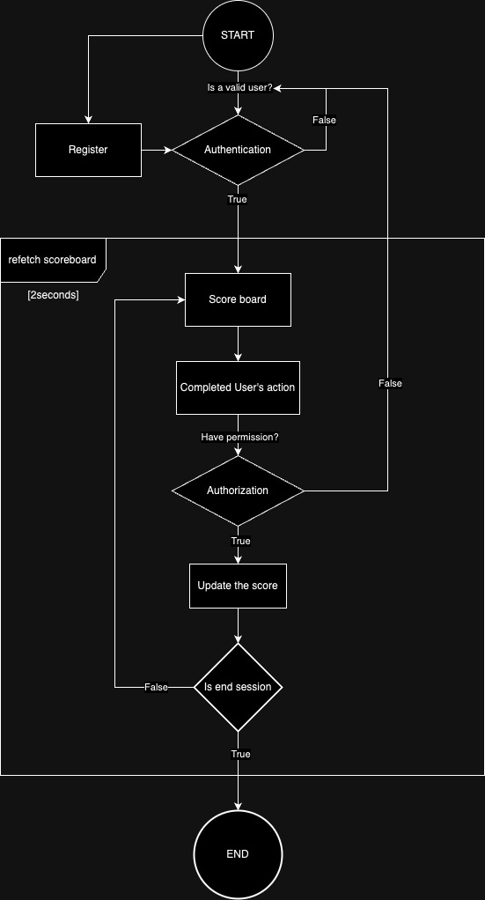

# Score board BE Specification

## 0. Software requirement

1. We have a website with a score board, which shows the top 10 user’s scores. User need to authentication to view the board. After authenticated user have a token which establish user's session and associated with user.

2. We want realtime update of the score board.

3. User can do an action (which we do not need to care what the action is). After the user's action have been completed, we will check a user's permission.

4. With authorization, the action will dispatch an API call to the application server to update the score.

5. We want to prevent malicious users from increasing scores without authorization.

6. After all, ask user for end session. If not, back to app flow before user's action.

**NOTE** 
- After every new user account, create them a associated score.
- One account must have only session token after authenticated.
- A session token must have necessary information for get specific user detail.
- A user's session token must be clear if expired.
- Create cronjob for refetch score board every a timing (2000 milliseconds).

## 1. App work flow diagram

## 2. Database design ideas

### 2.1. Entities
1. **userAccount**
- Fields: userInfo, userID(PK)
- Methods: authentication, authorization, register 
2. **2.2. Score board**
- Fields: userID(FK -> userAccount(userID) - CASCADE, required, unique), score(required - default=0)
- Methods: updateScore
3. **2.3. Session token**
- Fields: userID(FK -> userAccount(userID) - CASCADE, required, unique), token(required)
- Method: createToken, deleteToken
- Addition: May be we can store clue data's for recovering user session.

### 2.2. Triggers
1. Trigger in before update increase user's score, a associated session token of this user must be establish.
2. Trigger after create new user account, must create a associated record in score for presenting it user's score.

## 3. Middlewares

### 3.1. Authentication

1. This will check is user register before. And place it in our route.

2. After success, a token associated with user will be generated for session establish.

### 3.2. Authorization

1. This will check whether a authorized user or not. If not just remove session's toke and redirect to authenticated.

## 3. Response format

### 3.1. Response will be a JSON looks like:
- {
-  "status":httpStatusCode,
-  "data":responseData || [],
-  "message": message
-  "stack": errorStack (use for development purpose)
- }

### 3.2. HTTP status code (httpStatusCode: number)
**Success**:
  - 200 Success : Success HTTP.
**Error**:
  - 400 Bad Request: For missing information request.
  - 404 User not found: If username is not valid.
  - 401 Unauthenticated: For not authenticated.
  - 403 Forbidden: If the user does not have permission to update scores.
  - 500 Server Error: For our server's error.

## 4. Endpoints

### 4.1. `POST /register`

- **Description**: Create new user account

- **Response data (responseData)**
- `newUserID`

### 4.2 `POST /login`

- **Description**: Login user into system and create a user's session

- **Response data (responseData)**:
- `sessionToken`: Error will be an empty value

### 4.3. `GET /scores`

- **Description**: This endpoint retrieves the top 10 user scores. Will be recall every a timing (2000 milliseconds)

- **Request headers**
- sessionToken: Bearer {sessionToken}

- **Response data (responseData)**
- `scoreBoard`: Error will be an empty array
  - `message`: Message that show http result

- **Authorization**:
  - Authentication required.

### 4.4. `PUT /scores`

- **Description**: Update user score

- **Request headers**
- sessionToken: Bearer {sessionToken}

- **Request Body**:
  - `userID`: userID that indicate which user will be increase score 

- **Response data (responseData)**:
  - `message`: message that show http result

- **Authorization**:
  - This endpoint requires a valid authorization token to prevent unauthorized score updates.

## 5. Security Considerations

To prevent malicious users from increasing scores without authorization, the following security measures are implemented:

- Authorization is required for score updates (`POST /scores/update`).
- Check where a valid session token or not in every sensitive routes.

## Additional Comments
1. That is just a outlined. Feeling free for contacting me a changing through
[locle2001@gmail.com].
2. Meeting info: google meet link, schedule.

## Implementation Details (After meeting)
- Language:
- Database: 
- Framework:
- Project management tools:
- Source control tools: